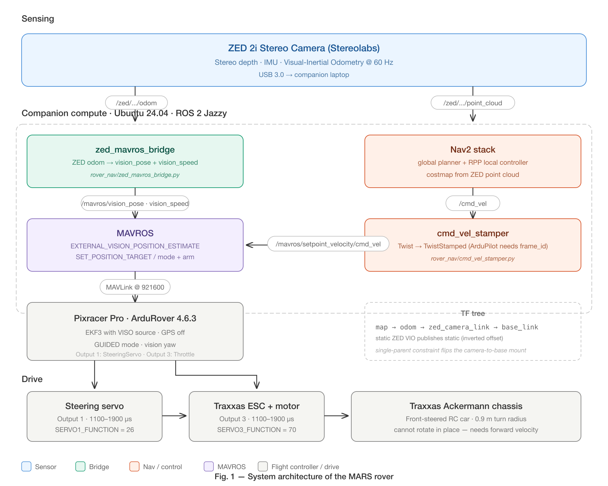

# MARS — Mobile Autonomous Rover System


> **Status — work in progress.** Indoor GPS-denied waypoint navigation is up and running on a Traxxas Ackermann chassis. The autonomy stack (ZED VIO → MAVROS → ArduPilot Rover GUIDED + Nav2 RPP) is functional end-to-end; ongoing work covers controller tuning, costmap inflation, and outdoor extension.

Indoor waypoint navigation for a Traxxas Ackermann-steering rover using **ArduPilot Rover**, a **ZED 2i** stereo camera for visual-inertial odometry, and **ROS 2 Nav2** for global planning and Regulated Pure Pursuit local control. No GPS, no compass — pose comes entirely from vision.

## Demo

<!--
  Drag-and-drop your mars.MOV (or assets/mars_demo.mp4) into the GitHub README editor right here
  to get a user-attachments URL. The fallback raw link below works once pushed.
-->

https://github.com/tarunkumarnyu/MARS/raw/main/assets/mars_demo.mp4

## System Architecture

<p align="center">
  
</p>

The ZED 2i publishes 60 Hz visual-inertial odometry. The `zed_mavros_bridge` node forwards it to MAVROS as `vision_pose` + `vision_speed`, which ArduPilot's EKF3 fuses as the only position source (GPS and compass are explicitly disabled). Nav2 plans on a costmap built from the ZED's point cloud and emits `cmd_vel`, which `cmd_vel_stamper` converts to the `TwistStamped` topic ArduPilot Rover requires. ArduPilot, in GUIDED mode, drives the steering servo on Output 1 and the ESC on Output 3.

### TF Tree

```
map → odom → zed_camera_link → base_link
 ↑      ↑              ↑              ↑
static  ZED VIO        static (inverted camera mount offset)
```

The ZED publishes `odom → zed_camera_link`. Because TF is a single-parent tree, `base_link` must be a **child** of `zed_camera_link`, not the other way around — so the static transform uses the inverted camera-to-base offset.

## Hardware

| Component | Model | Purpose |
|---|---|---|
| Chassis | Traxxas RC car (Ackermann steering) | Base platform — front-steered, ESC-driven |
| Flight controller | MRO Pixracer Pro | ArduPilot Rover firmware (v4.6.3) |
| Camera | ZED 2i (Stereolabs) | Stereo depth + Visual-Inertial Odometry (VIO) |
| Companion | Laptop (Ubuntu 24.04) | ROS 2, Nav2, MAVROS, ZED SDK |
| FC ↔ laptop | USB | `/dev/ttyACM0` @ 921600 baud |
| Camera ↔ laptop | USB 3.0 | Blue port required for ZED bandwidth |

**Wiring**

- **Pixracer Output 1** → Traxxas steering servo (`SERVO1_FUNCTION = 26`, GroundSteering)
- **Pixracer Output 3** → Traxxas ESC (`SERVO3_FUNCTION = 70`, Throttle)
- **Pixracer USB** → laptop (`/dev/ttyACM0` @ 921600)
- **ZED 2i** → laptop USB 3.0

## Software Stack

| Component | Version |
|---|---|
| Ubuntu | 24.04 LTS |
| ROS 2 | Jazzy Jalisco |
| ArduPilot | Rover v4.6.3 |
| MAVROS | `ros-jazzy-mavros` (apt) |
| Nav2 | `ros-jazzy-nav2-bringup` (apt) — **RegulatedPurePursuit** controller |
| ZED SDK + ROS 2 wrapper | v5.2.x (built from source in `~/zed_ws`) |

## Installation

### Prerequisites

```bash
# ROS 2 Jazzy
sudo apt install ros-jazzy-desktop

# MAVROS + geographic datasets
sudo apt install ros-jazzy-mavros ros-jazzy-mavros-extras
sudo /opt/ros/jazzy/lib/mavros/install_geographiclib_datasets.sh

# Nav2
sudo apt install ros-jazzy-nav2-bringup \
                 ros-jazzy-nav2-regulated-pure-pursuit-controller \
                 ros-jazzy-nav2-rviz-plugins \
                 ros-jazzy-topic-tools
```

### ZED ROS 2 wrapper (build from source)

```bash
mkdir -p ~/zed_ws/src && cd ~/zed_ws/src
git clone https://github.com/stereolabs/zed-ros2-wrapper.git
git clone https://github.com/stereolabs/zed-ros2-interfaces.git
cd ~/zed_ws
source /opt/ros/jazzy/setup.bash
colcon build --symlink-install
```

### MARS package

```bash
mkdir -p ~/rover_ws/src && cd ~/rover_ws/src
git clone https://github.com/tarunkumarnyu/MARS.git rover_nav
cd ~/rover_ws
source /opt/ros/jazzy/setup.bash
source ~/zed_ws/install/setup.bash
colcon build --packages-select rover_nav
```

## ArduPilot Parameters

These parameters must be set on the Pixracer once. They persist across reboots.

```bash
source ~/rover_ws/install/setup.bash
python3 ~/rover_ws/src/rover_nav/scripts/set_ardupilot_params.py
```

Then **power-cycle the Pixracer** (unplug USB, wait 3 s, replug) for `GPS1_TYPE` to take effect.

### EKF3 / vision sources

| Parameter | Value | Reason |
|---|---|---|
| `GPS1_TYPE` | `0` | Disable GPS (indoor). Requires reboot. |
| `VISO_TYPE` | `1` | Enable MAVLink visual odometry |
| `EK3_SRC1_POSXY` | `6` | Position XY from ExternalNav (vision) |
| `EK3_SRC1_VELXY` | `6` | Velocity XY from ExternalNav |
| `EK3_SRC1_POSZ` | `1` | Position Z from baro |
| `EK3_SRC1_VELZ` | `6` | Velocity Z from ExternalNav |
| `EK3_SRC1_YAW` | `6` | Yaw from ExternalNav |
| `COMPASS_USE` / `USE2` / `USE3` | `0` | Disable compass — magnetic interference indoors corrupts EKF yaw |

### Failsafe / mode

| Parameter | Value | Reason |
|---|---|---|
| `FS_THR_ENABLE` | `0` | Disable throttle failsafe (no RC TX) |
| `FS_EKF_ACTION` | `0` | Disable auto-HOLD on EKF failsafe |
| `MODE_CH` | `0` | Disable RC mode switch — let MAVROS own the mode |
| `ARMING_CHECK` | `0` | Disable arming checks during bring-up (re-enable to `1` later) |
| `BRD_SAFETY_DEFLT` | `0` | Safety switch defaults off |

### Servo

| Parameter | Value | Reason |
|---|---|---|
| `SERVO1_FUNCTION` | `26` | GroundSteering on Output 1 |
| `SERVO3_FUNCTION` | `70` | Throttle on Output 3 |
| `SERVO1_MIN/MAX/TRIM` | `1100 / 1900 / 1500` | Steering PWM range |
| `SERVO3_MIN/MAX/TRIM` | `1100 / 1900 / 1500` | ESC PWM range |
| `TURN_RADIUS` | `0.9` | Minimum turn radius (m) |

## Usage

### 1 — Bring up the full stack

```bash
source ~/zed_ws/install/setup.bash
source ~/rover_ws/install/setup.bash
ros2 launch rover_nav rover_bringup.launch.py
```

Wait until you see:
- `FCU: ArduRover V4.6.3` (MAVROS connected)
- ZED depth + odom topics publishing

### 2 — Set origin, arm, and switch to GUIDED

```bash
source ~/rover_ws/install/setup.bash
python3 ~/rover_ws/src/rover_nav/scripts/set_origin_and_arm.py
```

This script:
1. Sets the EKF origin (required after every Pixracer power-up)
2. Waits 15 s for EKF convergence
3. Arms the rover
4. Switches to GUIDED mode

You should see `READY! Send Nav2 goals now.`

### 3 — Send a navigation goal

**Command line**

```bash
# 2 m forward
ros2 topic pub --once /goal_pose geometry_msgs/msg/PoseStamped \
  "{header: {frame_id: 'map'}, pose: {position: {x: 2.0, y: 0.0}, orientation: {w: 1.0}}}"
```

**RViz2**

```bash
rviz2 -d ~/rover_ws/install/rover_nav/share/rover_nav/config/rover_nav.rviz
```

Use the *Nav2 Goal* button to click and drag goals on the map.

**Predefined waypoint mission**

```bash
ros2 launch rover_nav arm_and_go.launch.py
```

Arms, switches to GUIDED, and sends a square waypoint path.

## Verification Checklist

```bash
# 1. MAVROS connected
ros2 topic echo /mavros/state --once             # connected: true

# 2. ZED odom flowing
ros2 topic hz /zed/zed_node/odom                 # ~60 Hz

# 3. Vision pose reaching ArduPilot
ros2 topic hz /mavros/vision_pose/pose           # ~60 Hz

# 4. TF tree connected
ros2 run tf2_ros tf2_echo odom base_link         # valid transform

# 5. Nav2 lifecycle nodes active
for n in controller_server planner_server behavior_server bt_navigator waypoint_follower; do
  echo -n "$n: "; ros2 lifecycle get /$n
done                                              # all "active [3]"

# 6. cmd_vel flowing during navigation
ros2 topic hz /cmd_vel                           # ~10 Hz when a goal is active
```

## Key Design Decisions

1. **Nav2 nodes launched directly**, not via `navigation_launch.py`. Avoids `collision_monitor`, `docking_server`, and composition-mode bugs that silently break parameter loading on Jazzy.
2. **`cmd_vel_stamper` instead of `topic_tools relay`.** ArduPilot Rover only responds to `TwistStamped` with a populated `frame_id`; plain `Twist` is silently ignored.
3. **`use_rotate_to_heading: false`** in nav2_params.yaml. Ackermann vehicles cannot rotate in place — the controller must always command forward velocity together with steering.
4. **`zed_camera_link → base_link`** as the static TF, not the natural way around. ZED publishes `odom → zed_camera_link`, and TF requires a single parent per frame, so the static mount transform is inverted.
5. **MAVROS wrapped in a `GroupAction`.** Stops the MAVROS XML launch's namespace from leaking into the ZED launch and remapping its topics under `/mavros/...`.
6. **Compass fully disabled.** Indoor magnetic interference fights the vision yaw and causes EKF divergence within seconds.
7. **`MODE_CH = 0`.** Pins the FC mode to MAVROS control — without this, the (absent) RC channel keeps overriding the mode back.

## Troubleshooting

<details>
<summary><b>EKF variance / EKF failsafe</b></summary>

Most common bring-up issue. The EKF is not converging on the vision data.

1. Power-cycle the Pixracer (unplug USB, wait 3 s, replug)
2. Restart the launch
3. Re-run `set_origin_and_arm.py`
4. **Wait 15 s** before arming
5. Verify `COMPASS_USE = 0` and `FS_EKF_ACTION = 0`
</details>

<details>
<summary><b>"AHRS: waiting for home"</b></summary>

ArduPilot has no home position. Set the EKF origin via `set_origin_and_arm.py` — required after every power-cycle.
</details>

<details>
<summary><b>Flight mode change failed</b></summary>

- Verify `MODE_CH = 0` (RC mode switch overrides MAVROS otherwise)
- Check EKF is healthy (no "EKF variance" messages)
- Power-cycle and re-init
</details>

<details>
<summary><b>Rover not moving / servos stuck at 1500 µs</b></summary>

| Cause | Fix |
|---|---|
| EKF unhealthy | Power-cycle, wait for convergence |
| Not in GUIDED | `ros2 service call /mavros/set_mode mavros_msgs/srv/SetMode "{custom_mode: 'GUIDED'}"` |
| Not armed | `ros2 service call /mavros/cmd/arming mavros_msgs/srv/CommandBool "{value: true}"` |
| `cmd_vel` not flowing | `ros2 topic hz /cmd_vel` — goal may have completed or failed |
</details>

<details>
<summary><b>Steering doesn't work but throttle does</b></summary>

| Cause | Fix |
|---|---|
| Steering on wrong output | Must be on Output 1 |
| Servo not powered | Pixracer servo rail needs BEC power |
| `use_rotate_to_heading: true` | Set to `false` — Ackermann cannot rotate in place |
</details>

<details>
<summary><b>Nav2 nodes stuck "inactive"</b></summary>

The lifecycle manager couldn't activate them because `odom → base_link` TF wasn't available when Nav2 started. Restart the launch — the 5 s startup delay should handle it.
</details>

<details>
<summary><b>MAVROS: <code>/dev/ttyUSB0: No such file</code></b></summary>

```bash
ls /dev/ttyACM* /dev/ttyUSB*
ros2 launch rover_nav rover_bringup.launch.py fcu_url:=serial:///dev/ttyACM0:921600
```
</details>

<details>
<summary><b>ZED topics under <code>/mavros/zed/...</code> instead of <code>/zed/zed_node/...</code></b></summary>

The MAVROS XML launch leaked its namespace. Wrap MAVROS in a `GroupAction` in the launch file (already done in this repo).
</details>

<details>
<summary><b>Nav2 loads <code>DWBLocalPlanner</code> instead of <code>RegulatedPurePursuit</code></b></summary>

Nav2's `navigation_launch.py` in composition mode doesn't load custom params correctly. This repo launches the Nav2 nodes directly to fix it.
</details>

<details>
<summary><b>Nav2 plugin class not found</b></summary>

Nav2 Jazzy uses `::` separator for plugin class names, not `/`.

| Wrong | Correct |
|---|---|
| `nav2_behaviors/Spin` | `nav2_behaviors::Spin` |
| `nav2_navfn_planner/NavfnPlanner` | `nav2_navfn_planner::NavfnPlanner` |
| `nav2_bt_navigator/NavigateToPoseNavigator` | `nav2_bt_navigator::NavigateToPoseNavigator` |
| `nav2_costmap_2d::ObstacleCostMapLayer` | `nav2_costmap_2d::ObstacleLayer` |
| `nav2_costmap_2d::InflationCostMapLayer` | `nav2_costmap_2d::InflationLayer` |
</details>

<details>
<summary><b><code>cmd_vel</code> published but servos don't respond</b></summary>

ArduPilot Rover requires `TwistStamped` (with `frame_id`), not `Twist`. Use the bundled `cmd_vel_stamper` node instead of `topic_tools relay`.
</details>

## Package Structure

```
MARS/
├── architecture.svg / architecture.png   # System architecture diagram
├── assets/mars_demo.mp4                  # Demo video (compressed)
├── config/
│   ├── nav2_params.yaml                  # Nav2 — RPP controller, costmaps, planner
│   └── rover_nav.rviz                    # RViz2 with Nav2 Goal tool
├── launch/
│   ├── rover_bringup.launch.py           # Full system bringup (MAVROS + ZED + Nav2 + bridge)
│   └── arm_and_go.launch.py              # Arm + GUIDED + send waypoints
├── rover_nav/
│   ├── zed_mavros_bridge.py              # ZED VIO odom → MAVROS vision_pose / vision_speed
│   ├── cmd_vel_stamper.py                # Twist → TwistStamped for MAVROS
│   └── arm_and_go.py                     # Arm, set GUIDED, send Nav2 waypoints
├── scripts/
│   ├── set_ardupilot_params.py           # One-time ArduPilot parameter setup
│   └── set_origin_and_arm.py             # Per-session startup (origin + arm + GUIDED)
├── package.xml
├── setup.py
└── setup.cfg
```

## Roadmap

- [ ] Controller tuning — RPP lookahead vs. settling on tight indoor turns
- [ ] Costmap inflation tuning for narrow corridors
- [ ] Outdoor mode with GPS fallback (re-enable `GPS1_TYPE`, `EK3_SRC2_*` blend)
- [ ] Recovery behaviours for EKF reset / TF stalls
- [ ] Multi-waypoint mission UI / playback

## Stack

`ROS 2 Jazzy` · `ArduPilot Rover` · `MAVROS` · `Nav2` · `Regulated Pure Pursuit` · `ZED SDK` · `Visual-Inertial Odometry` · `EKF3` · `Pixracer Pro` · `Traxxas`

## License

This project is licensed under the [MIT License](LICENSE).
